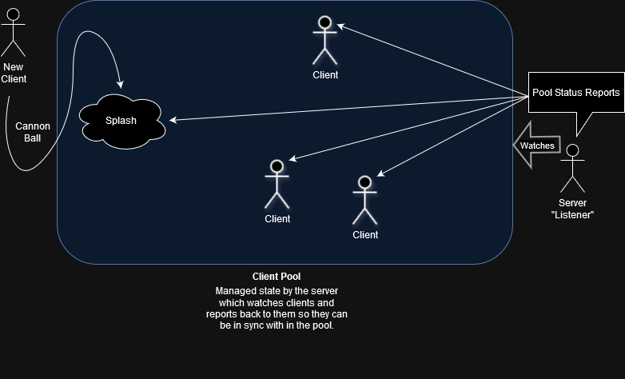

# Ruby CLI-Chat Client/Server

Ensure you have Ruby installed.

This is a basic example of how a TCP server socket can be created for running a CLI or Gosu window chat service. It contains a server.rb and a client.rb Ruby script for running and maintaining an interface for a chat system. Client sessions have managed data set up as string byte blocks to provide and example of how to package an array of data for transmission. Additionally the chat when running in ApplicationWindow mode utilizing Gosu, a GameWorld is managed with WorldObjects shared between server client sessions.

### Start Server
```ruby
ruby server.rb
```
Server will log out client activity.

### Start one/many clients
```ruby
ruby client.rb <username>
```
>User name can not contain any spaces.

Type into the console and start chatting with other clients connected to the server.

To shut down either the server or a client, just close the terminal window.

### Helpful Documentation Links

https://ruby-doc.org/3.2.2/

[Ruby TCPSocket object](https://ruby-doc.org/3.2.2/exts/socket/TCPSocket.html) \
[Ruby UDPSocket object](https://docs.ruby-lang.org/en/2.2.0/UDPSocket.html) \
[Socket Basics](https://docs.oracle.com/cd/E19120-01/open.solaris/817-4415/sockets-18552/index.html) \
[Socket Message](https://manpages.ubuntu.com/manpages/noble/en/man2/recv.2.html) \
[How to get Public IP](https://stackoverflow.com/questions/13270042/get-public-remote-ip-address) \
[Net::HTTP, Net::HTTPS, and Net::FTP](https://ruby-doc.org/stdlib-2.6.3/libdoc/open-uri/rdoc/OpenURI.html)


## Notes on TCP sockets

A "safe" ball park for max payload that can be sent in a single package using TCP sockets is 1024 bytes (1 KiB).

Maximum theoretical size of a TCP packet is 64K (65535 bytes). Package size gets restricted by the Maximum Transmission Unit (MTU) of network resources. MTU is the maximum size of the data transfer limit set by hardware in a network. Keep in mind that Ethernet MTU is 1500 bytes, the IP header is normally 20 bytes, and TCP header which is at least 20.

## Default Common TCP and UDP Ports

* SMTP - 25  'Simple Mail Transfer Protocol' 
* HTTP - 80  'Hypertext Transfer Protocol' 
* HTTPS - 443 SSL (Secure Socket Layer) HTTP 
* FTP - 20, 21 "File Transfer Protocol"
    - Port 20 FTP active mode
    - Port 21 FTP signaling for mode
* TELNET - 23 Virtual terminal protocol to make a connection with the server TCP/IP protocol 
* IMAP - 143 'Internet Message Access Protocol' application Layer of a TCP/IP Model 
* RDP - 3389 'Remote Desktop Protocol' 
* SSH - 22 'Secure Shell' 
* DNS - 53 'Domain Name System' 
* DHCP - 67, 68 'Dynamic Host Configuration Protocol'
    - UDP Port 67 accepts address requests from DHCP and sending the data to the server
    - UDP Port 68 responds to all the requests of DHCP and forwards data to the client
* POP3 - 110 'Post Office Protocol' Version 3

### Things Yet To Do

* Client authentication management
* Client/Server graceful shutdowns
* Gosu Game
* UDP sockets
* ZeroMQ stuff maybe


## Ruby pack string op flags

[Ruby Packed data](https://ruby-doc.org/3.2.2/packed_data_rdoc.html) \
[How to use Ruby pack() unpack()](https://www.rubyguides.com/2017/01/read-binary-data)

Integer Directive   | Array Element |  Byte Size | Meaning
:------------------:|:--------------|:----------:|:--------------------------------------------------
C         | Integer |   1 byte  | 8-bit unsigned (unsigned char)
S         | Integer |   2 byte  | 16-bit unsigned, native endian (uint16_t)
L         | Integer |   4 byte  | 32-bit unsigned, native endian (uint32_t)
Q         | Integer |   8 byte  | 64-bit unsigned, native endian (uint64_t)
‌‌          |         |           | 
c         | Integer |   1 byte  | 8-bit signed (signed char)
s         | Integer |   2 byte  | 16-bit signed, native endian (int16_t)
l         | Integer |   4 byte  | 32-bit signed, native endian (int32_t)
q         | Integer |   8 byte  | 64-bit signed, native endian (int64_t)
‌‌          |         |           | 
S_, S!    | Integer |   2 byte  | unsigned short, native endian
I, I_, I! | Integer |   4 byte  | unsigned int, native endian
L_, L!    | Integer |  4/8 byte | unsigned long, native endian  (32 bit / 64 bit system)
‌‌          |         |           | 
s_, s!    | Integer |   2 byte  | signed short, native endian
i, i_, i! | Integer |   2 byte  | signed int, native endian
l_, l!    | Integer |   2 byte  | signed long, native endian
‌‌          |         |           | 
n         | Integer |   2 byte  | 16-bit unsigned, network (big-endian) byte order
N         | Integer |   4 byte  | 32-bit unsigned, network (big-endian) byte order
v         | Integer |   2 byte  | 16-bit unsigned, VAX (little-endian) byte order
V         | Integer |   4 byte  | 32-bit unsigned, VAX (little-endian) byte order
‌‌          |         |           | 
U         | Integer |   1 byte  | UTF-8 character
w         | Integer |  ~ bytes  | BER-compressed integer
‌‌          |         |           | 
D, d      | Float   |   8 byte  | double-precision, native format
F, f      | Float   |   4 byte  | single-precision, native format
E         | Float   |   8 byte  | double-precision, little-endian byte order
e         | Float   |   4 byte  | single-precision, little-endian byte order
G         | Float   |   8 byte  | double-precision, network (big-endian) byte order
g         | Float   |   4 byte  | single-precision, network (big-endian) byte order

String Directive    | Array Element | Meaning
:------------------:|:--------------|:--------------------------------------------------
A         | String  | arbitrary binary string (space padded, count is width)
a         | String  | arbitrary binary string (null padded, count is width)
Z         | String  | same as ``a'', except that null is added with *
B         | String  | bit string (MSB first)
b         | String  | bit string (LSB first)
H         | String  | hex string (high nibble first)
h         | String  | hex string (low nibble first)
u         | String  | UU-encoded string
M         | String  | quoted printable, MIME encoding (see RFC2045)
m         | String  | base64 encoded string (see RFC 2045, count is width)
‌‌          |         | (if count is 0, no line feed are added, see RFC 4648)
P         | String  | pointer to a structure (fixed-length string)
p         | String  | pointer to a null-terminated string

Misc. Directive     |            | Meaning
:------------------:|:----------:|:--------------------------------------------------
@                   |            | moves to absolute position
X                   |            | back up a byte
x                   |            | null byte

[Table Source](https://rubydoc.info/stdlib/core/1.9.3/Array:pack)


### Style Guide

This project takes advantage of the [Community Guide](https://rubystyle.guide/) driven styler that utilizes the [Rubocop Gem](https://rubocop.org/)
to provide a 'lint' (with out configuration options) making code more clear by advising against the use of defining
declarative syntax and avoid character enclosures when ran. Just more cold and calculating with less characters
required to do the same job. Also unifies the language creating a standard of 'use-case' in an evolving landscape
of one off code snippets across a multitude of [Ruby](https://www.ruby-lang.org/en/) versions. In the end, experiment
how ever you want. When releasing, it may help to follow a rich community guide attempting to set a standard with the syntax.
Usually I'll just run the following to auto correct most common issues and log the results to file for review.
```shell
rubocop --fix-layout --autocorrect --extra-details -o './rubo_layout-log.txt'

rubocop --lint -o './rubo_lint-log.txt'
```

Ruby also has a built in toolkit that can be used without the Rubocop gem installed which also is worth checking out.
```shell
ruby -wc

-w: This option enables warnings about problematic code.
-c: This option tells Ruby to check the syntax of the code but not to execute it.
```


### Fun stuff to know

When using an ApplicationWindow you can take advantage of the InputControls bound to it. To do so, bellow
are some examples of how to do it.

```ruby
$application.controls.holding?(:move_up)
$application.controls.holding?(:move_down)
$application.controls.holding?(:shift)

$application.controls.trigger?(:menu_action)
$application.controls.trigger?(:menu_up)
$application.controls.trigger?(:cancel_action)
$application.controls.trigger?(:action_key)

$application.controls.holding?(:mouse_lclick)
$application.controls.trigger?(:mouse_lclick)
$application.mouse_x.to_i()
$application.mouse_y.to_i()
```

#### General Concepts


